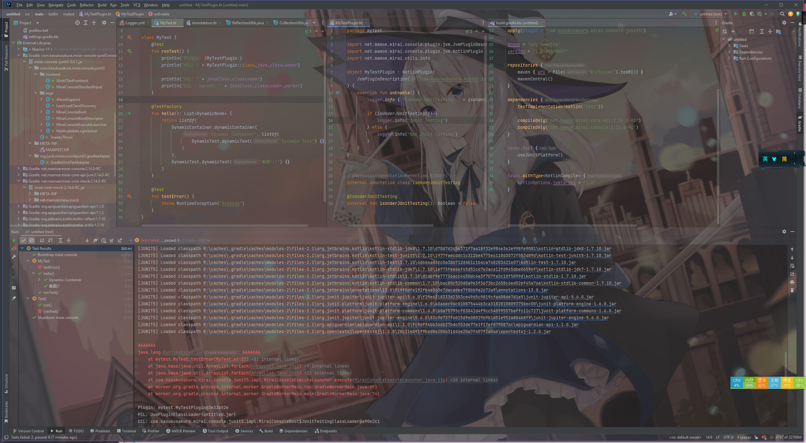

# mirai-console-junit5

--------

在 mirai-console 中启动 JUnit5 测试

### 使用

在 build.gradle(.kts) 添加 

```groovy
plugins {
    id "com.kasukusakura.mirai-console-junit5" version "0.0.2"
}
```

### 预览图




### 使用手册

见 [for-dev.md](./docs/for-dev.md)
